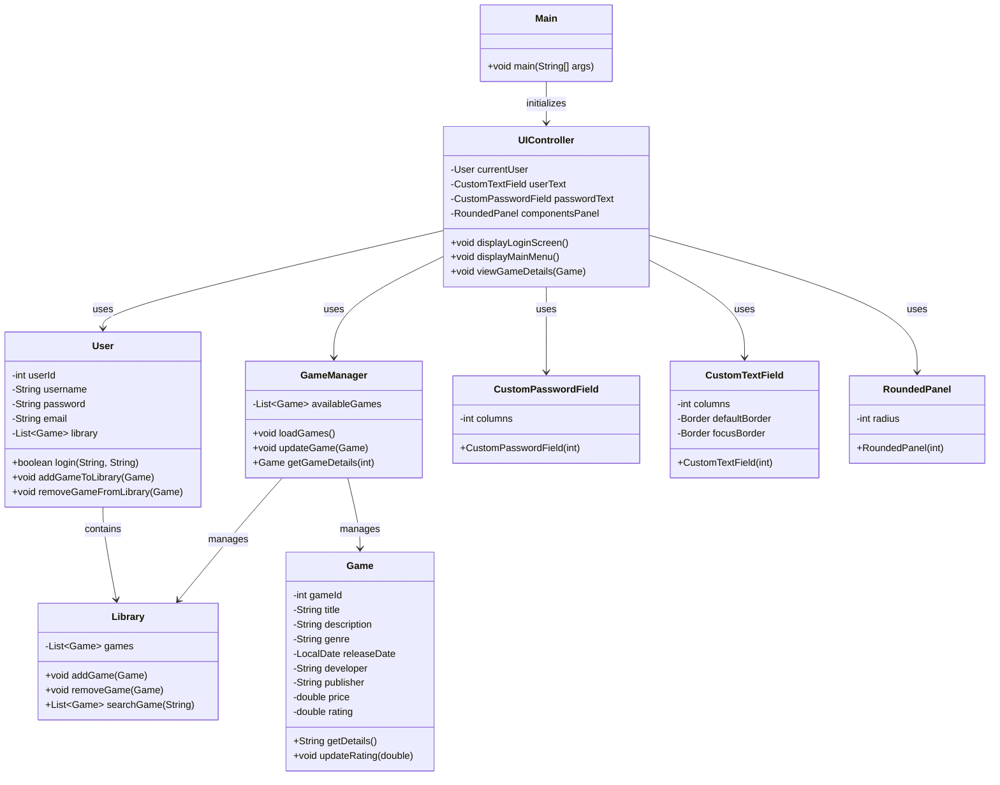

# **Games Launcher**

### DAM 1

#### *by: [Anxo Fdez](https://github.com/Anx0Fdez) & [Ana Valladares](https://github.com/anavalladaresg)*

---

This project is a game launcher developed in Java. Currently, we have implemented the user interface and the login logic.

## Current Progress

- User interface with login and registration panel.
- Login and registration logic.
- Basic structure of the `Game`, `User`, `Library`, `GameManager`, `UIController` and `Main` classes.

## Class Diagram

