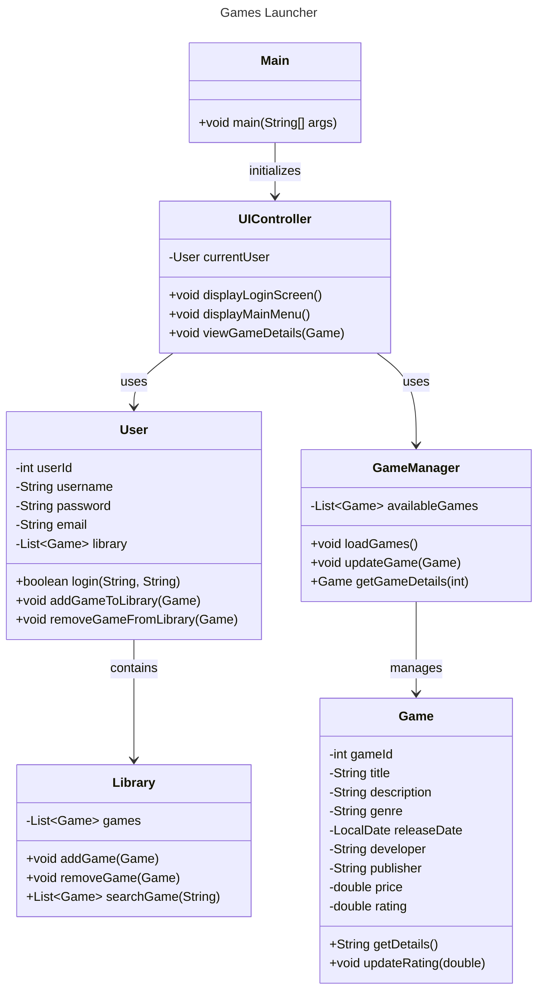

# **Solar System**
### DAM 1
#### *by: [Anxo Fdez](https://github.com/Anx0Fdez) & [Ana Valladares](https://github.com/anavalladaresg)*

---

```mermaid
---
title: Games Launcher
---
classDiagram
    class Game {
        -int gameId
        -String title
        -String description
        -String genre
        -LocalDate releaseDate
        -String developer
        -String publisher
        -double price
        -double rating
        +String getDetails()
        +void updateRating(double)
    }

    class User {
        -int userId
        -String username
        -String password
        -String email
        -List~Game~ library
        +boolean login(String, String)
        +void addGameToLibrary(Game)
        +void removeGameFromLibrary(Game)
    }

    class Library {
        -List~Game~ games
        +void addGame(Game)
        +void removeGame(Game)
        +List~Game~ searchGame(String)
    }

    class GameManager {
        -List~Game~ availableGames
        +void loadGames()
        +void updateGame(Game)
        +Game getGameDetails(int)
    }

    class UIController {
        -User currentUser
        +void displayLoginScreen()
        +void displayMainMenu()
        +void viewGameDetails(Game)
    }

    class Main {
        +void main(String[] args)
    }

    User --> Library : contains
    GameManager --> Game : manages
    UIController --> User : uses
    UIController --> GameManager : uses
    Main --> UIController : initializes
```