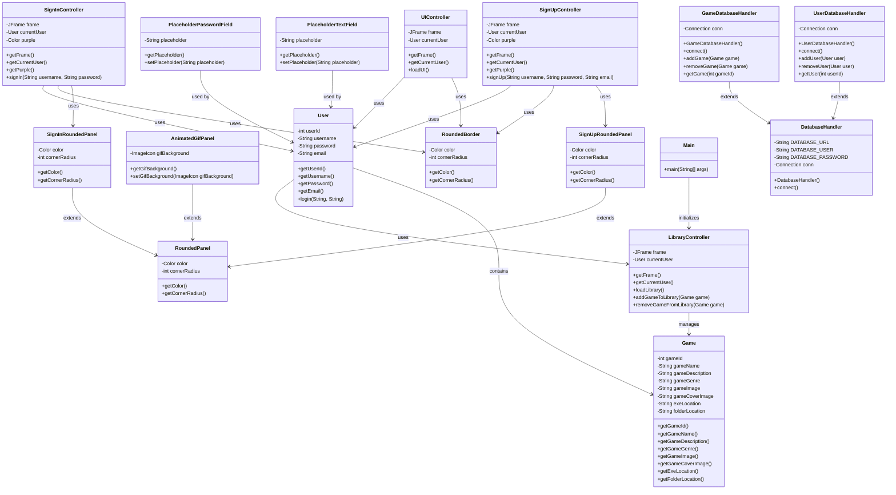

## Games Launcher

### DAM 1

#### *by: [Anxo Fdez](https://github.com/Anx0Fdez) & [Ana Valladares](https://github.com/anavalladaresg)*

----

_The Games Launcher project has reached its final stage, with significant strides made in the development of the user interface and the underlying logic._

## Final Progress
- Completed the user interface for the sign-up panel, including the design and implementation of a custom button with a rounded border.
- Implemented the logic for the sign-up process, including validation of alphanumeric usernames and passwords, and checking for existing users in the database.
- Enhanced the user experience by adding keyboard listeners to the username and password fields, allowing the user to press the enter key to trigger the sign-up button.
- Added mouse listeners to the sign-up button to change its color and cursor when the mouse enters and exits the button area.
- Developed methods to display the sign-in screen and the main menu.
- Refined the structure and functionality of the `Game`, `User`, `Library`, `GameManager`, `SignInController`, `SignUpController`, `SignUpRoundedPanel`, `SignInRoundedPanel`, `RoundedBorder`, `PlaceHolderTextField`, `PlaceHolderPasswordField`, `LibraryController`, `UIController` and `Main` classes.
- Developed the custom UI components like `PlaceHolderTextField`, `PlaceHolderPasswordField`, `SignUpRoundedPanel`, `SignInRoundedPanel`, and `RoundedBorder`.
- Expanded the functionality of the `GameManager` class to manage the game collection.
- Enhanced the `User` class to handle user login functionality.
- Improved the `LibraryController` class to manage the library view functionality.

The team has worked diligently on the Games Launcher project, with a focus on enhancing the user experience and expanding the functionality of the game management system.

## Class Diagram
